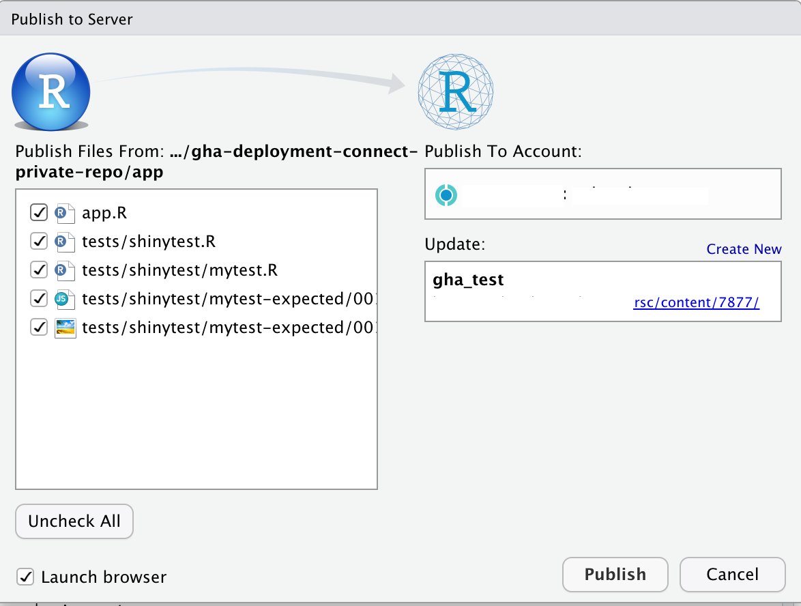
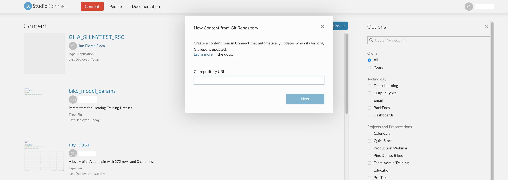
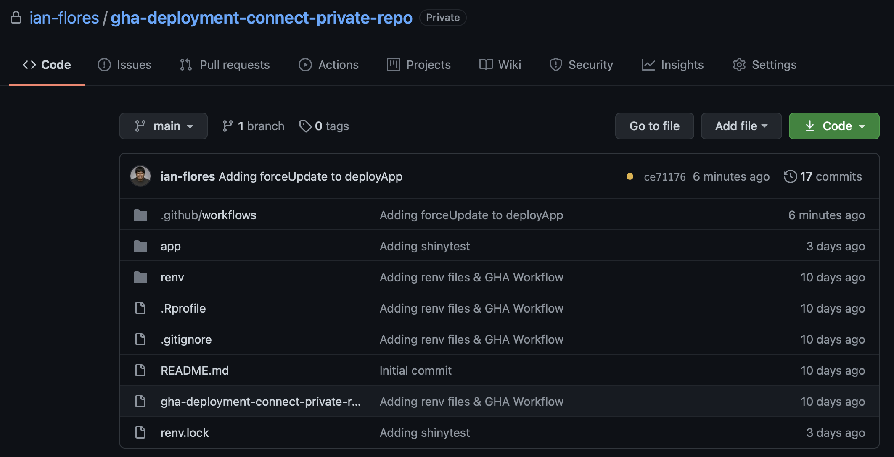

When you want to publish a data artifact to RStudio Connect you have three main routes you can follow. The first one is following a button deployment process, which means within the IDE you establish your credentials, you press publish at the top right corner of your source code pane, and voila! You have your content available in Connect. 



The second route you can follow is a Git-backed deployment from within the Connect interface. To do this, you log in into our account and on the drop down in the main panel select the option `Import from Git` and follow the process to connect our Git repository to Connect.



However this process has some caveats. If you want to publish private Git repositories, you need to add a service account to the repositories and add the credentials of this service account into the Connect configuration file. Another caveat is the fact that you can’t execute tests before publishing your artifact because it will assume that the version that it is fetching is ready for production use. This is where GitHub Actions come into play. 

GitHub Actions is a tool from GitHub that allows you to automate workflows, test your software and build images or packages as needed, meaning that it acts as a CI/CD tool. One of the benefits of using Actions is that it allows you to integrate tests into your deployment pipeline to RStudio Connect, you can publish from private repositories without having to manage a service account, and you get the benefits of Continuous Deployment. 

Now that you understand why you want to use GitHub Actions and their benefits let’s discuss an example to showcase how to use them. In this example you will be testing a Shiny App and then publishing it to Connect. To simplify the package management of the environment you will use the `renv` package. It is useful in terms of reproducibility because it will save the package version and from what repository you installed the package so that you can restore the environment in other computers. You can read more about `renv` [here](https://rstudio.github.io/renv/index.html). Below you can see how the files are organized in the repository, and you can access them [here](https://github.com/ian-flores/gha-deployment-connect-private-repo).




As you can see the app lives in the `app/` directory, and within this directory lives the tests of the app as well. However, our main file of interest lives in `.github/workflows/deploy_to_connect.yml` and it specifies the workflow that will run today. I'll go over the contents of the GitHub Action file so you understand what is going on.

On the first five lines I specify what event triggers this actions to run. Here I am specifying that whenever there is a push to the `main` or `master` branches, the jobs specified in this action will run.

```yaml
on:
  push:
    branches:
      - main
      - master
```

On these lines, I specify on which OS I want to run our job annd the environment variables. Note that within the `env` key, I have specified variables in two ways. One of them being just specifying the variable argument and the other one is using the mechanism of GitHub secrets. These secrets are a method that GitHub offers to manage sensitive information or credentials in a secure manner without having to expose it. To access them I use the `secrets` keyword and then the name of the variable I want to access.

```yaml
jobs:
  deploy-to-connect:
    runs-on: macOS-latest
    env:
      APP_NAME: "GHA_SHINYTEST_RSC"
      APP_DIR: "app"
      GITHUB_PAT: ${{ secrets.GITHUB_TOKEN }}
      RSCONNECT_URL: ${{ secrets.RSCONNECT_URL }}
      RSCONNECT_USERNAME: ${{ secrets.RSCONNECT_USERNAME }}
      RSCONNECT_APIKEY: ${{ secrets.RSCONNECT_APIKEY }}
```

You can specify your secrets in the settings panel of your repository.


Now that I have specified the necessary information to setup our environment, I now have to specify what does the job actually do. I do this under the `steps` key and each entry it's treated as a different step to the job. The first step is checking out the files of the repository so that I have them available to 1) install the packages the app needs to run and 2) deploy the actual app to RStudio Connect. The second step is setting up R. For these two steps I use actions that already exist and that's why I use the `uses` key. 

```yaml
    steps:
      - uses: actions/checkout@v2

      - uses: r-lib/actions/setup-r@master
```

In these next two steps I install `renv` and restore our environment. Restoring our environment means installing the packages listed in the `renv.lock` file with their dependencies and matching versions. One thing to note here is that I specify what we want to run in the `run` key and then on the `shell` key I specify what program will execute the `run` key content and pass it as an argument.

```yaml
      - name: Install renv
        run: |
          install.packages("renv")
        shell: Rscript {0}

      - name: Restore environment
        run: |
          renv::restore()
        shell: Rscript {0}
```

After restoring our environment and having the necessary packages installed, I now want to execute the shinytests I have developed in order to see if our app is ready for publishing. In order to use `shinytest` I first have to install some dependencies in our environment, which is what I do in the first step. After I have these dependencies installed I execute our tests, if they are successful I can move on to dealing with RStudio Connect. If they are not successful, the job will fail and I will have to review the app.

```yaml
      - name: Install shinytest dependencies
        run: |
          shinytest::installDependencies()
        shell: Rscript {0}

      - name: Run shinytest tests
        run: |
          shinytest::testApp("${{ env.APP_DIR }}")
        shell: Rscript {0}
```

Once the tests are completed successfully I will aunthenticate with the RStudio Connect server. To interact with RStudio Connect I use the `rsconnect` package. I first register which RStudio Connect server I'll be interacting with, and then provide the credentials for the specific user that will be publishing into the platform.

```yaml
      - name: Authenticate with RStudio Connect
        run: |
          rsconnect::addConnectServer(url = "${{ env.RSCONNECT_URL}}",
                            name = "rsc_server")
          rsconnect::connectApiUser(account = "${{ env.RSCONNECT_USERNAME }}",
                          server = "rsc_server",
                          apiKey = "${{ env.RSCONNECT_APIKEY }}",
                          quiet = FALSE)
        shell: Rscript {0}
```

As a final step, after authenticating, I deploy our app using the `deployApp` function. This will create the `manifest.json` file, bundle the application and push the bundle to RStudio Connect. Notice that I am using the argument `forceUpdate` set to TRUE, this is because I want the application to re-update in RStudio Connect every time the job gets to this point. Also notice that we use `appTitle` and not `appName`, if you use `appName` your app won't be able to update.

```yaml
      - name: Deploy app
        run: |
          rsconnect::deployApp(appDir = "${{ env.APP_DIR }}",
                     appTitle = "${{ env.APP_NAME }}",
                     account = "${{ env.RSCONNECT_USERNAME }}",
                     server = "rsc_server",
                     forceUpdate = TRUE)
        shell: Rscript {0}
```

Now that I've showcased how to deploy your data products into RStudio Connect using GitHub Actions I hope that publishing these products from private GitHub repositories will be easier to manage for data scientists. 

All the code for the application and the GitHub Actions is available at this repo: https://github.com/ian-flores/gha-deployment-connect-private-repo
